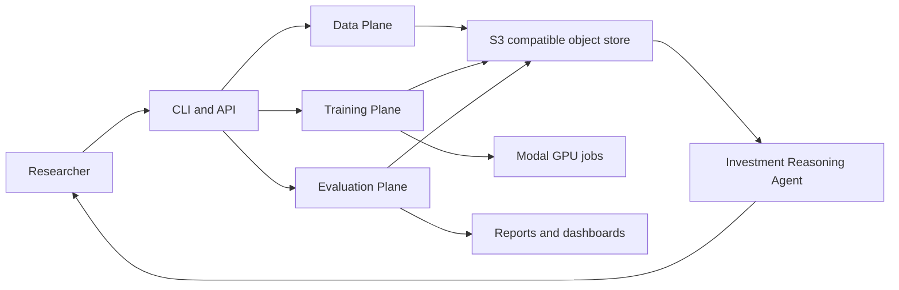
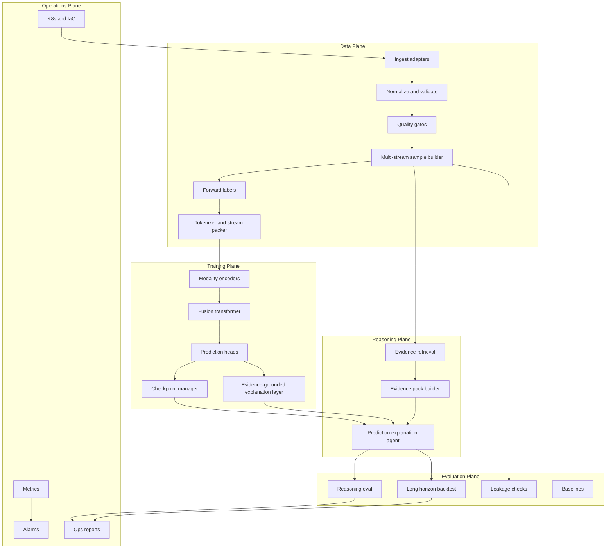
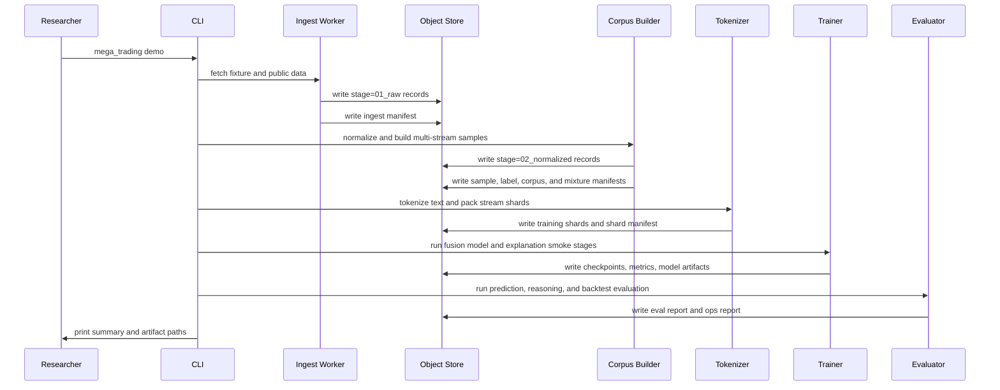
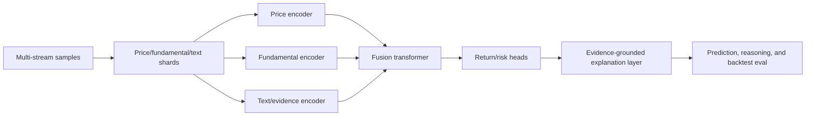

# High-Level Design

## Overview

Mega-Trading is a prototype infra-model co-design platform for a foundation model of trading. The system turns public financial data into auditable multi-stream training signal, trains small trading foundation-model variants, and evaluates outputs through prediction quality, explanation faithfulness, long-horizon backtesting, and infrastructure health metrics.

The design is intentionally end-to-end. The model is not an afterthought behind an infra demo, and the infrastructure is not generic plumbing. They are co-designed around a shared contract:

- What data was available at a given `as_of_time`.
- How raw documents, fundamentals, and price windows became model-visible streams.
- Which labels were generated after the as-of boundary.
- Which modality encoders and fusion blocks consumed which data mixture.
- Whether the model can predict forward return/risk targets and cite evidence for the explanation.
- Whether outputs can be evaluated through realistic long-horizon portfolio metrics.
- Whether the system is observable, recoverable, and fast enough for research iteration.

## Design Goals

### Product Goals

- Build a multi-input market foundation model for long-term investment research.
- Preserve the structure of finance data: price series, fundamentals, text evidence, labels, and lineage should not be collapsed into weak text-only summaries.
- Produce forward return/risk predictions with evidence-grounded explanations, not opaque short-term predictions.
- Evaluate model outputs with prediction metrics, explanation metrics, and long-horizon finance metrics.
- Preserve source lineage so every answer can be audited back to data, model, and config.

### Infrastructure Goals

- Support offline and continuously updated public market data.
- Use S3-compatible object storage as the primary artifact layer.
- Provide deterministic local runs and cloud/GPU training paths.
- Containerize all runtimes.
- Provide Kubernetes and infrastructure-as-code deployment definitions.
- Emit metrics, alarms, and end-to-end timing reports.
- Support checkpoint/resume and failure-injection tests.

### Research Velocity Goals

- Minimize time from new data to first evaluated model output.
- Make corpus mixtures, training stages, and eval runs reproducible from configs.
- Let researchers run small local smoke tests before launching Modal GPU jobs.
- Make bottlenecks visible: ingestion, quality, tokenization, dataloading, training, checkpointing, and evaluation.

## Non-Goals

Mega-Trading is not:

- A live trading system.
- A low-latency signal engine.
- An autonomous portfolio manager.
- A claim of tradable alpha.
- A frontier-scale model training run.
- A replacement for human investment judgment.

The prototype should demonstrate system discipline and model-training feasibility, not production investing performance.

## System Context

The researcher interacts with the system through a CLI, API, and generated reports. The object store is the system of record for source data, derived corpora, training shards, checkpoints, model artifacts, evaluation outputs, and lineage manifests.

## Architecture

Mega-Trading is organized into five major planes:

- **Data plane**: ingestion, normalization, quality, label generation, multi-stream sample construction, and tokenization.
- **Training plane**: multi-stream supervised training, checkpointing, and metrics.
- **Reasoning plane**: retrieval, evidence packaging, prediction explanation, and structured thesis generation.
- **Evaluation plane**: reasoning evaluation, long-horizon backtesting, leakage checks, and baselines.
- **Operations plane**: metrics, alarms, runbooks, deployment, failure injection, and end-to-end efficiency tracking.

## Component Design

### CLI And API

The CLI is the primary interface for the prototype. The API can expose the same workflows for local services and Kubernetes jobs.

Key commands:

- `mega-trading ingest`
  - Fetch or load public financial data.
- `mega-trading train-trading-foundation-model`
  - Train the multi-stream TradingFoundationModel.
- `mega-trading reason`
  - Generate evidence-grounded investment theses.
- `mega-trading eval`
  - Run reasoning evaluation and backtesting.
- `mega-trading ops-report`
  - Emit metrics, alarms, lineage, and end-to-end timing.
- `mega-trading demo`
  - Run the deterministic end-to-end fixture path.

### Data Ingest Adapters

The ingestion layer should support both fixture data and live public data.

Initial adapters:

- SEC EDGAR submissions and company facts.
- Historical prices from `yfinance` or Stooq.
- FinanceBench open-source sample.
- FinQA/TAT-QA-style financial reasoning examples.
- Optional GDELT/RSS/news adapter for continuous updates.

Each adapter writes raw records to `stage=01_raw/` and emits an ingestion manifest:

- Source name.
- Fetch timestamp.
- Source timestamp.
- Request parameters.
- Record count.
- Content hash.
- Schema version.
- Known limitations.

### Normalization And Quality

Normalization converts heterogeneous raw data into typed records:

- `DocumentRecord`
- `FundamentalRecord`
- `PriceRecord`
- `QuestionAnswerRecord`
- `EventRecord`
- `EvidenceRecord`

Quality checks should include:

- Required fields.
- Valid timestamps.
- Duplicate detection.
- Ticker/CIK/entity mapping.
- Missing fundamentals.
- Price coverage.
- Source freshness.
- Language and text-length filters.
- Future leakage checks where labels are present.

Invalid records should be quarantined instead of silently dropped.

### Sample Builder

The sample builder creates foundation-model training examples from normalized records.

Sample contents:

- trailing price windows.
- point-in-time fundamentals.
- visible evidence snippets.
- forward-return and risk labels.

Every sample record must include:

- `sample_id`
- `source_ids`
- `ticker`
- `company`
- `as_of_time`
- `price_window`
- `fundamental_facts`
- `text_evidence`
- `labels`
- `mixture_name`
- `quality_score`
- `metadata`

Sample mixtures are config-driven. A mixture may combine tickers, date ranges, input windows, and label horizons with explicit config.

### Tokenizer And Shard Builder

The shard builder turns sample records into compact stream shards for model training.

Responsibilities:

- Tokenize text/evidence records.
- Package price windows, fundamental facts, and labels into stream-specific shards.
- Preserve sample boundaries and source IDs.
- Write shard files and shard manifests.
- Support streaming reads during training.

Shard manifests should include:

- Number of examples.
- Source sample IDs.
- Content hash.
- Creation timestamp.

### Training Orchestrator

The training orchestrator launches local smoke tests and Modal GPU jobs.

Training stage:

- **Multi-stream supervised training**
  - Train modality encoders and a fusion transformer over price, fundamental, and text/evidence streams.
  - Metric: forward-return bucket quality, risk prediction quality, calibration, examples/sec, and data-loader wait ratio.

The orchestrator should share core components across stages:

- Config loading.
- Dataset/shard loading.
- Checkpoint manager.
- Metrics emitter.
- Artifact writer.
- Resume validation.

### Checkpoint Manager

The checkpoint manager is responsible for reliability.

It should track:

- Model weights or adapter weights.
- Optimizer state where applicable.
- Scheduler state.
- Step number.
- Random seed state.
- Training config.
- Shard cursor.
- Metrics history.

The demo should include a checkpoint/resume validation path:

1. Train for a small number of steps.
2. Save checkpoint.
3. Simulate interruption.
4. Resume from checkpoint.
5. Verify step count, config hash, and eval continuity.

### Reasoning Agent Runtime

The reasoning runtime generates investment thesis outputs.

Flow:

1. Receive ticker, `as_of_time`, and horizon.
2. Retrieve only evidence available before `as_of_time`.
3. Build an evidence pack with source IDs and snippets.
4. Run model inference using the selected checkpoint or adapter.
5. Validate output schema.
6. Attach lineage.
7. Store output for evaluation.

The model output must be auditable. If evidence is missing or weak, the agent should lower confidence or refuse to make a strong claim.

### Evaluation Engine

The evaluation engine has three roles:

- Check whether the reasoning is faithful and well-formed.
- Check whether generated rankings have long-horizon signal.
- Check whether infrastructure behaved correctly.

Reasoning evaluation:

- Schema compliance.
- Evidence coverage.
- Citation accuracy.
- Faithfulness.
- Temporal correctness.
- Numerical reasoning accuracy.
- Uncertainty quality.

Backtesting evaluation:

- 3/6/12-month forward returns.
- Rank IC.
- Precision@k.
- Bucketed forward returns.
- Long/short spread.
- Benchmark-relative return.
- Sharpe, Sortino, max drawdown.
- Turnover and transaction-cost sensitivity.

Infrastructure evaluation:

- Raw-to-corpus time.
- Corpus-to-shards time.
- Shards-to-first-checkpoint time.
- Checkpoint-to-eval time.
- Total raw-to-eval time.
- Tokens/sec.
- Dataloader wait ratio.
- Checkpoint save and resume time.
- Alerts triggered.

### Observability And Alarms

Observability is part of the product, not a stretch goal.

Metrics should be emitted as JSONL and optionally exposed in Prometheus format.

Data alarms:

- Stale source feed.
- Duplicate spike.
- Low entity mapping coverage.
- Missing prices or fundamentals.
- High quarantine rate.
- Future leakage detected.

Training alarms:

- Low tokens/sec.
- High dataloader wait ratio.
- NaN loss.
- Stalled loss.
- Checkpoint failure.
- Resume validation failure.
- Modal job failure.
- GPU OOM.

Evaluation alarms:

- Citation accuracy regression.
- Schema compliance regression.
- Temporal correctness failure.
- Backtest leakage detected.
- E2E cycle-time regression.

The demo should include failure injection for at least two alarm paths.

## Data Flow

## Training Flow

The multi-stream path is the core model path. Text-only artifacts are intentionally excluded from the MVP training pipeline so the project stays focused on market prediction samples.

## Artifact Contracts

### Ingest Manifest

Required fields:

- `manifest_id`
- `source`
- `source_uri`
- `fetch_time`
- `record_count`
- `content_hash`
- `schema_version`
- `status`
- `errors`

### Sample Manifest

Required fields:

- `sample_version`
- `mixture_name`
- `source_manifest_ids`
- `record_count`
- `as_of_min`
- `as_of_max`
- `quality_summary`

### Shard Manifest

Required fields:

- `shard_id`
- `sample_version`
- `stream_contract`
- `num_samples`
- `content_hash`
- `source_sample_ids`

### Training Run Manifest

Required fields:

- `run_id`
- `stage`
- `base_model`
- `adapter_type`
- `train_config_hash`
- `data_mixture_version`
- `shard_ids`
- `checkpoint_paths`
- `metrics_path`
- `status`

### Model Artifact Manifest

Required fields:

- `model_version`
- `base_model`
- `adapter_paths`
- `training_run_ids`
- `data_mixture_version`
- `eval_run_ids`
- `created_at`
- `limitations`

### Reasoning Output Manifest

Required fields:

- `output_id`
- `ticker`
- `as_of_time`
- `horizon`
- `model_version`
- `evidence_ids`
- `prompt_version`
- `lineage`
- `schema_validation_status`

## Deployment Design

### Local Development

Local development should run through Docker Compose:

- API or CLI container.
- Worker container.
- MinIO object store.
- Optional Prometheus/Grafana stack.

The local path must be deterministic and runnable without private credentials.

### Kubernetes

Kubernetes should host the data/control plane:

- Ingest worker Deployment or CronJob.
- Sample builder Job.
- Stream shard builder Job.
- Training launcher Job.
- API Deployment.
- ConfigMaps for non-secret configs.
- Secrets templates for credentials.
- Persistent or object-store-backed artifact storage.
- Prometheus scrape configuration.

### Modal

Modal should host GPU training jobs:

- TradingFoundationModel training job.

Modal jobs should read from and write to the same artifact contracts as local jobs. The local CPU path remains the reviewer-friendly fallback.

### Infrastructure As Code

Terraform and Kubernetes manifests should define:

- Buckets or local object-store equivalents.
- Service configuration.
- Secret templates.
- Namespace and service account layout.
- Alert rules.
- Optional AWS mapping for S3/EKS/Ray.

## MVP Scope

### Must Have

- Deterministic fixture demo.
- Data ingestion and normalized records.
- Multi-stream sample builder with `as_of_time`, source IDs, price windows, fundamentals, evidence tokens, and labels.
- Stream shards for price, fundamental, text/evidence, and label tensors.
- Tiny fusion model smoke test with prediction heads.
- Evidence-grounded prediction and explanation output contract.
- 3/6/12-month forward-return evaluation for a small universe or fixture.
- Metrics and ops report.
- At least two alert simulations.
- Dockerized runtime.
- Kubernetes/IaC skeleton.

### Should Have

- Modal GPU entry points.
- FinanceBench or FinQA-derived examples.
- Price/fundamentals live adapter.
- Checkpoint/resume validation.
- Baselines: random, momentum, simple value, text-only LLM, price-only model, fundamentals-only model.

### Can Defer

- Full S&P 500 ingestion.
- Large-scale distributed training.
- Production-grade vector database.
- Rich UI dashboard.
- Real proprietary data connectors.
- Multi-node FSDP/DeepSpeed implementation.

## Scaling Path

The prototype should scale along clear dimensions:

- More data sources: proprietary research, paid fundamentals, transcripts, macro, credit, options, real estate.
- More compute: Modal to internal GPU clusters, Ray, EKS, FSDP/DeepSpeed.
- Better samples: higher-quality extraction, deduplication, entity resolution, richer price/fundamental/text windows, and leakage controls.
- Better training: larger fusion models, longer windows, richer labels, and stronger encoders.
- Better evaluation: walk-forward experiments, broader universes, factor controls, regime splits.
- Better operations: SLOs, incident workflows, cost dashboards, and model/data governance.

## Key Design Trade-Offs

### Small Model Versus Real Model

The demo uses small models because the submission window is short. This is acceptable because the project is about proving system and model contracts together. The design keeps model size independent from data and artifact contracts, so larger fusion models can replace the demo model later.

### Fixture Data Versus Live Data

The demo needs deterministic fixture data for reliability. Live public adapters are still valuable, but they should not be required for the reviewer to run the project.

### Backtesting Signal Versus Explanation Quality

The model may not produce strong investment signal in 72 hours. The evaluation stack should still compute real finance metrics, but the project should frame them as diagnostics. Explanation quality, lineage, calibration, and leakage control are equally important.

### K8s Completeness Versus Implementation Depth

Kubernetes and IaC should show deployability, but the implementation should prioritize a working end-to-end local demo. A strong local demo plus clear K8s manifests is better than a broad but broken platform.

## Open Questions

- Which tiny fusion architecture should be the default: MLP+cross-attention, shallow transformer encoders, or a tabular/time-series transformer?
- Should the initial universe be hand-picked large-cap companies or dynamically selected from S&P 500 fixtures?
- Which forward-return horizon should be the first supervised target: 20D, 60D, 120D, or 12-month?
- Should retrieval be simple lexical search in the MVP, or should a vector index be included?
- Which backtesting horizon should be the headline metric: 3-month, 6-month, or 12-month?

## Recommended Implementation Order

1. Define artifact schemas and configs.
2. Build deterministic fixture data.
3. Implement object-store abstraction and manifests.
4. Implement ingestion and normalization.
5. Implement label generation and multi-stream sample builder.
6. Implement tokenizer and stream shard builder.
7. Implement tiny fusion model smoke test.
8. Implement evaluation and backtesting.
9. Implement metrics, alarms, and ops report.
10. Add Docker, K8s, IaC, Modal entry points.
11. Polish README and demo output.

## Success Criteria

The high-level design is successful if a reviewer can understand:

- What problem the system solves.
- Why it is not just a FinGPT clone.
- How public data becomes training signal.
- How the model is trained from multi-stream samples.
- How outputs are audited back to evidence.
- How long-horizon evaluation is performed without obvious leakage.
- How the system is operated, monitored, and deployed.
- How the prototype scales to a real finance foundation model lab.
