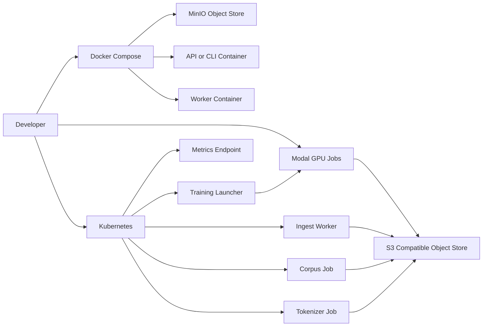

# Observability And Deployment Design

## Purpose

The Observability and Deployment module makes Mega-Trading operable.

The project should not only run. It should show whether it is healthy, efficient, recoverable, and deployable. This is especially important for the AI Infrastructure Engineer (Training Systems) role, where the system must maximize learning per unit of compute and expose failures before they waste expensive GPU time.

This module owns:

- metrics architecture.
- alarm-as-code.
- failure injection.
- ops reports.
- Docker runtime.
- Kubernetes deployment.
- Terraform/IaC layout.
- Modal GPU job integration.
- runbooks.
- end-to-end time-to-result tracking.
- cost and efficiency reporting.

## Design Goals

### Operability Goals

- Every important workflow should emit metrics.
- Every run should produce a human-readable ops report.
- Common failure modes should trigger explicit alarms.
- Runs should be reproducible from configs and manifests.

### Deployment Goals

- Local demo should run through Docker.
- Data/control plane should be deployable to Kubernetes.
- GPU training should run through Modal.
- Infrastructure definitions should be versioned and reviewable.

### Efficiency Goals

- Measure raw-data-to-eval wall-clock time.
- Measure training throughput and dataloader bottlenecks.
- Estimate GPU cost per run.
- Report learning per unit of compute.

## Metrics Architecture

Metrics should be emitted at three levels:

- component metrics.
- run-level metrics.
- end-to-end workflow metrics.

### Metrics Format

MVP:

- JSONL metrics files.
- run summary JSON.
- markdown ops report.

Optional:

- Prometheus text exposition.
- Grafana dashboard JSON.

Recommended layout:

```text
runs/
  <run_id>/
    metrics.jsonl
    run_manifest.json
    ops_report.md
    alerts.json
    cost_report.json
```

### Metric Event Schema

Fields:

- `timestamp`
- `run_id`
- `component`
- `stage`
- `metric_name`
- `metric_value`
- `unit`
- `tags`

Example:

```json
{
  "timestamp": "2026-05-08T17:00:00Z",
  "run_id": "demo-run",
  "component": "trainer",
  "stage": "trading_foundation_model",
  "metric_name": "tokens_per_second",
  "metric_value": 1842.5,
  "unit": "tokens/s",
  "tags": {
    "model": "qwen2.5-0.5b",
    "device": "modal-a10g"
  }
}
```

## Metrics By Plane

### Data Plane Metrics

- `ingest_records_total`
- `ingest_records_per_second`
- `ingest_errors_total`
- `source_freshness_seconds`
- `duplicate_rate`
- `quarantine_rate`
- `entity_mapping_coverage`
- `missing_price_coverage`
- `missing_fundamental_coverage`
- `corpus_build_seconds`
- `corpus_records_total`
- `leakage_violations_total`

### Training Plane Metrics

- `train_loss`
- `eval_loss`
- `perplexity`
- `tokens_per_second`
- `examples_per_second`
- `step_time_seconds`
- `dataloader_wait_ratio`
- `sequence_packing_efficiency`
- `checkpoint_save_seconds`
- `checkpoint_resume_seconds`
- `tokens_per_gpu_second`
- `estimated_cost_per_1m_tokens`

### Reasoning Metrics

- `reasoning_latency_seconds`
- `evidence_retrieval_seconds`
- `evidence_pack_tokens`
- `schema_validation_pass_rate`
- `citation_resolvability_rate`
- `claims_with_citations_rate`
- `temporal_violation_rate`
- `insufficient_evidence_rate`

### Evaluation Metrics

- `eval_runtime_seconds`
- `schema_pass_rate`
- `citation_accuracy`
- `rank_ic`
- `precision_at_k`
- `max_drawdown`
- `turnover`
- `missing_price_rate`
- `leakage_check_pass`

### End-To-End Metrics

- `raw_to_corpus_seconds`
- `corpus_to_shards_seconds`
- `shards_to_first_checkpoint_seconds`
- `checkpoint_to_eval_seconds`
- `raw_to_eval_seconds`
- `alerts_triggered_total`
- `demo_wall_clock_seconds`

## Alarm-As-Code

Alarms should be declared in config, not only described in prose.

Recommended file:

```text
configs/alarms.yaml
```

Example categories:

- data freshness.
- data quality.
- training throughput.
- dataloader bottleneck.
- checkpoint failure.
- temporal leakage.
- eval regression.
- e2e cycle time.

Example alarm definition:

```yaml
alarms:
  - name: slow_dataloader
    metric: dataloader_wait_ratio
    condition: ">"
    threshold: 0.25
    severity: warning
    description: "Trainer is waiting on input pipeline for more than 25% of step time."

  - name: future_leakage_detected
    metric: leakage_violations_total
    condition: ">"
    threshold: 0
    severity: critical
    description: "Future data entered a model-visible artifact or evaluation path."
```

## Alarm Categories

### Data Alarms

- stale source feed.
- duplicate spike.
- high quarantine rate.
- low entity mapping coverage.
- missing price coverage.
- missing fundamentals coverage.
- leakage detected.

### Training Alarms

- low tokens/sec.
- high dataloader wait.
- NaN loss.
- stalled loss.
- checkpoint save failure.
- resume validation failure.
- GPU OOM.
- Modal job failure.

### Reasoning Alarms

- schema validation failure spike.
- citation resolvability drop.
- temporal violation.
- unsupported claim rate spike.
- insufficient evidence spike.

### Evaluation Alarms

- backtest leakage detected.
- missing price rate above threshold.
- baseline comparison failed.
- eval runtime regression.

### E2E Alarms

- raw-to-eval time exceeds threshold.
- first checkpoint time exceeds threshold.
- ops report generation failed.

## Failure Injection

Failure injection makes infra behavior visible.

### MVP Failure Cases

#### Stale Feed

Inject a source record with an old `source_time`.

Expected result:

- freshness metric increases.
- stale feed alarm triggers.
- ops report lists the source as stale.

#### Slow Dataloader

Inject artificial delay into shard loading.

Expected result:

- dataloader wait ratio increases.
- slow dataloader alarm triggers.
- ops report suggests tokenization/cache/prefetch mitigation.

#### Future Leakage

Inject a future-dated evidence record into an evaluation fixture.

Expected result:

- leakage check fails.
- evaluation report marked invalid.
- critical alarm triggers.

#### Checkpoint Resume Mismatch

Resume from checkpoint with incompatible config hash.

Expected result:

- resume validation fails.
- checkpoint alarm triggers.
- run stops before corrupting outputs.

### CLI

Commands:

- `mega-trading inject stale-feed`
- `mega-trading inject slow-dataloader`
- `mega-trading inject future-leakage`
- `mega-trading inject checkpoint-mismatch`

## Ops Report

Every demo or training run should produce an ops report.

Required sections:

- run metadata.
- data health.
- training efficiency.
- reasoning quality.
- evaluation summary.
- alarms triggered.
- checkpoint/resume status.
- e2e timing.
- cost estimate.
- limitations.
- next debugging steps.

Example headline fields:

- `raw_to_eval_seconds`
- `tokens_per_second`
- `dataloader_wait_ratio`
- `checkpoint_resume_passed`
- `leakage_check_passed`
- `alerts_triggered`
- `estimated_gpu_seconds`
- `estimated_cost_per_1m_tokens`

## Deployment Architecture



## Docker Design

### Containers

MVP containers:

- `mega-trading`
  - CLI, API, ingestion, corpus, eval, local training.
- `minio`
  - local S3-compatible object store.
- optional `prometheus`
  - scrape metrics if enabled.
- optional `grafana`
  - dashboard if enabled.

### Dockerfile Goals

- deterministic Python environment.
- CPU-compatible local demo.
- optional GPU extras for training.
- no private credentials baked into image.

### Docker Compose Goals

- one-command local stack.
- persistent MinIO volume.
- environment variables for object store.
- deterministic fixture demo.

Example commands:

- `docker compose up`
- `docker compose run mega_trading mega_trading demo`
- `docker compose run mega_trading mega_trading ops-report --run-id demo`

## Kubernetes Design

Kubernetes deploys the data/control plane.

### Resources

- Namespace: `mega-trading`
- ConfigMaps:
  - data configs.
  - training configs.
  - alarm configs.
- Secrets:
  - SEC user-agent contact if needed.
  - object-store credentials.
  - Modal token template.
- Deployments:
  - API service.
  - optional metrics endpoint.
- Jobs:
  - corpus builder.
  - tokenizer.
  - local training smoke test.
- CronJobs:
  - periodic ingestion.
  - freshness check.
- ServiceAccounts:
  - least-privilege per workload.

### MVP K8s Scope

The MVP does not need a production cluster. It should provide manifests that can run on `kind` or `k3d`.

Required:

- namespace.
- config map.
- ingest job.
- corpus builder job.
- tokenizer job.
- training launcher job.
- metrics service or job outputs.

## Terraform / IaC Design

Terraform should define infrastructure intent.

MVP scope:

- local/minio bucket names.
- optional AWS S3 bucket sketch.
- IAM policy skeleton.
- Kubernetes namespace reference.
- secret templates.

Future scope:

- EKS cluster.
- S3 buckets.
- IAM roles.
- CloudWatch or managed Prometheus.
- ECR image registry.
- Ray cluster.
- GPU node groups.

## Modal Integration

Modal handles GPU jobs.

### Responsibilities

- build or reuse training image.
- mount or fetch shard artifacts.
- run TradingFoundationModel training stages.
- write checkpoints and metrics.
- return run summary.

### Required Metadata

Each Modal run should record:

- Modal app/function.
- GPU type.
- start/end time.
- duration.
- estimated GPU seconds.
- config hash.
- shard manifest IDs.
- checkpoint paths.
- model artifact path.

## Cost Metrics

Cost awareness is a core training systems signal.

Track:

- GPU type.
- GPU seconds.
- tokens processed.
- tokens per GPU-second.
- estimated cost per 1M tokens.
- object-store read/write bytes.
- checkpoint storage bytes.

Cost estimate config:

```yaml
cost:
  gpu_hourly_rates:
    A10G: 1.10
    L4: 0.80
  object_store_per_gb_month: 0.023
```

The exact numbers can be approximate for the demo, but the accounting path should exist.

## Runbooks

Runbooks should be short and practical.

Initial runbooks:

- stale source feed.
- slow dataloader.
- low tokens/sec.
- NaN loss.
- checkpoint failure.
- resume mismatch.
- future leakage detected.
- Modal job failed.
- raw-to-eval regression.

Each runbook should include:

- symptom.
- likely causes.
- metrics to inspect.
- first mitigation.
- escalation path.

## CLI And API

### CLI

Commands:

- `mega-trading ops-report --run-id <run_id>`
- `mega-trading alerts eval --metrics <path> --config configs/alarms.yaml`
- `mega-trading deploy local`
- `mega-trading deploy k8s`
- `mega-trading deploy modal-check`
- `mega-trading inject slow-dataloader`
- `mega-trading inject future-leakage`

### API

Optional endpoints:

- `GET /health`
- `GET /metrics`
- `GET /runs/{run_id}/ops-report`
- `GET /runs/{run_id}/alerts`
- `POST /failure-injection/{scenario}`

## MVP Scope

### Must Have

- JSONL metrics emitter.
- run manifest.
- ops report.
- alarm config.
- alarm evaluator.
- failure injection for stale feed and slow dataloader or leakage.
- Dockerfile.
- Docker Compose.
- K8s manifest skeleton.
- Modal entry point metadata.
- cost estimate in run summary.

### Should Have

- Prometheus-compatible metrics output.
- Grafana dashboard spec.
- Terraform local/minio resources.
- runbooks.
- checkpoint failure injection.
- E2E timing breakdown.

### Can Defer

- full production monitoring stack.
- real Alertmanager integration.
- CloudWatch deployment.
- EKS cluster creation.
- GPU node management.
- advanced profiling traces.

## Scaling Path

### Observability Scale

- Prometheus + Grafana.
- OpenTelemetry traces.
- structured logs.
- GPU utilization metrics.
- CPU/memory/network metrics.
- object-store latency metrics.

### Deployment Scale

- EKS.
- Ray.
- internal GPU clusters.
- multi-node training jobs.
- autoscaling workers.
- separate staging/prod namespaces.

### Reliability Scale

- retry policies.
- backoff.
- dead-letter queues.
- checkpoint replication.
- artifact retention.
- incident management workflow.

### Cost Scale

- budget alerts.
- experiment cost attribution.
- cost per model improvement.
- spot/on-demand comparison.
- GPU utilization dashboards.

## Open Questions

- Should Prometheus be included in the local demo or only documented?
- Which failure injection scenarios should be required for the 72-hour submission?
- Should K8s manifests be plain YAML, Kustomize, or Helm?
- Should Terraform provision real AWS resources or remain a local/AWS sketch?
- How should Modal costs be estimated if no actual GPU job is run by the reviewer?
- Should ops report be markdown only or also rendered through a lightweight dashboard?

## Success Criteria

This module is successful if:

- Every run emits metrics.
- Every important artifact has a manifest.
- At least two failure scenarios trigger alarms.
- The demo reports raw-to-eval time.
- Training efficiency and cost are visible.
- Checkpoint/resume status is visible.
- Docker can run the deterministic local path.
- K8s/IaC show a credible deployment path.
- Modal integration shows a credible GPU training path.
- Reviewers can see the system is designed to be operated, not merely executed.
