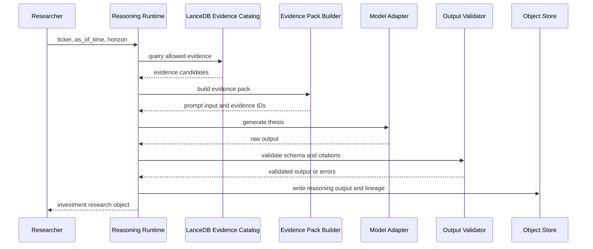

# Reasoning And Evidence Design

## Purpose

The Reasoning and Evidence module turns trained model artifacts and time-bounded financial evidence into auditable long-term investment theses.

This module is the product-facing layer of MarketFM Forge. It should make the model useful to a researcher without hiding the system constraints:

- What evidence was available?
- What evidence was used?
- What investment thesis did the model form?
- How confident is the model?
- What would invalidate the thesis?
- Was the answer temporally valid?
- Can the output be reproduced from data, prompt, model, and config lineage?

The module is not a trading signal generator. It is an evidence-grounded research reasoning runtime.

## Design Goals

### Reasoning Goals

- Generate long-term value investing theses.
- Separate business quality, valuation, catalysts, risks, and uncertainty.
- Cite evidence for material claims.
- Avoid unsupported recommendations.
- Prefer calibrated uncertainty over false precision.

### Evidence Goals

- Retrieve only evidence available before `as_of_time`.
- Preserve exact source IDs and snippets.
- Make every output auditable.
- Support both deterministic fixture evidence and live public evidence.

### Infrastructure Goals

- Version prompts, evidence packs, model artifacts, and output schemas.
- Store reasoning outputs as artifacts for evaluation.
- Validate schemas and citations automatically.
- Emit reasoning metrics and failure modes.

## Runtime Flow



## Inputs

### Required Inputs

- `ticker` or `entity_id`
- `as_of_time`
- `horizon`
- `model_version`
- `prompt_version`
- `evidence_policy`

### Optional Inputs

- target benchmark.
- portfolio context.
- sector constraints.
- requested focus area, such as valuation, risk, moat, or catalyst.
- max evidence documents.
- max token budget.

## Evidence Catalog

The Evidence Catalog indexes model-visible source material. In the MVP, normalized evidence is stored in LanceDB tables such as `silver_evidence_fixture`; object-store JSONL remains the replay/audit path.

Evidence sources:

- SEC filings.
- XBRL fundamentals.
- earnings calls.
- earnings press releases.
- historical prices.
- news and macro snippets.
- FinanceBench-style evidence passages.
- fixture documents.

Each evidence item should include:

- `evidence_id`
- `entity_id`
- `ticker`
- `source_type`
- `document_id`
- `timestamp`
- `as_of_time`
- `text`
- `uri`
- `section`
- `page`
- `content_hash`
- `quality_score`

## Evidence Retrieval

### Retrieval Constraints

Retrieval must enforce:

- `evidence.timestamp <= request.as_of_time`
- source must be allowed by evidence policy.
- entity must match the requested company or explicitly linked peer/market context.
- future labels and forward returns must not be retrieved.

### MVP Retrieval

The MVP can use simple retrieval:

- filter by ticker and `as_of_time`.
- rank by source type priority.
- use keyword or lexical scoring.
- include top filing snippets, fundamentals summary, and recent news/earnings evidence.

This is enough to prove the reasoning and auditability contract.

The runtime should read from LanceDB when a table store is configured, then fall back to object-store JSONL only for deterministic compatibility tests.

### Scaling Retrieval

Future retrieval can add:

- vector index.
- hybrid lexical + embedding retrieval.
- reranker.
- section-aware filing retrieval.
- peer/company relationship graph.
- long-context evidence compression.
- retrieval quality evals.

## Evidence Pack Builder

The Evidence Pack Builder converts retrieved evidence into a bounded model input.

Responsibilities:

- enforce token budget.
- group evidence by source type.
- preserve source IDs inline.
- include `as_of_time` clearly.
- include unavailable-data warnings when evidence is sparse.
- exclude future or ambiguous evidence.

Recommended evidence pack structure:

```text
Task:
  Produce a long-term investment thesis as of {as_of_time}.

Company:
  {ticker}, {company_name}, {sector}

Investment horizon:
  {horizon}

Evidence:
  [E1] 10-K Item 7, accepted 2023-02-15
       ...
  [E2] Company facts, available 2023-02-15
       Revenue: ...
  [E3] Price history through 2023-12-31
       ...

Instructions:
  Use only evidence above.
  Cite evidence IDs for material claims.
  State uncertainty when evidence is incomplete.
  Do not claim guaranteed returns.
```

## Prompt Versioning

Prompts are part of the model artifact lineage.

Prompt metadata:

- `prompt_version`
- `template_hash`
- `task_type`
- `required_output_schema`
- `evidence_policy`
- `created_at`
- `notes`

Prompt versions should be stored under:

```text
configs/prompts/
  investment_thesis_v1.yaml
  evidence_qa_v1.yaml
  risk_review_v1.yaml
```

## Output Schema

The model should produce a structured investment research object.

Required fields:

- `company`
- `ticker`
- `as_of_time`
- `horizon`
- `investment_view`
- `ranking_score`
- `confidence`
- `thesis`
- `business_quality`
- `valuation`
- `catalysts`
- `risks`
- `uncertainties`
- `evidence`
- `lineage`

### Investment View

Allowed MVP values:

- `attractive`
- `neutral`
- `unattractive`
- `insufficient_evidence`

### Ranking Score

The ranking score should be a bounded numeric value.

Rules:

- score range: 0 to 1.
- higher means more attractive long-term risk/reward.
- score should not be interpreted as probability of positive return.
- score must be evaluated only through backtesting diagnostics.

### Confidence

Confidence should reflect evidence quality and reasoning certainty.

Confidence should decrease when:

- evidence is sparse.
- evidence conflicts.
- valuation data is missing.
- recent filings are unavailable.
- model output has weak citation support.

## Lineage

Every reasoning output must include lineage.

Required lineage fields:

- `model_version`
- `base_model`
- `adapter_version`
- `data_mixture_version`
- `shard_ids`
- `prompt_version`
- `evidence_pack_id`
- `retrieval_config_hash`
- `generation_config`
- `run_id`

Lineage enables:

- auditability.
- reproducibility.
- eval comparison.
- debugging.
- future model registry integration.

## Validation

### Schema Validation

Required checks:

- valid JSON or strict markdown schema.
- required fields present.
- field types valid.
- score ranges valid.
- horizon valid.
- evidence IDs resolvable.

### Citation Validation

Required checks:

- every cited `evidence_id` exists.
- cited evidence timestamp is not after `as_of_time`.
- material claims have at least one citation.
- evidence snippets are included in the output artifact or resolvable through URI.

### Temporal Validation

Required checks:

- retrieved evidence satisfies `timestamp <= as_of_time`.
- model output does not cite future evidence.
- generated thesis does not mention post-`as_of_time` outcomes.
- forward returns are never included in evidence pack.

## Low-Confidence And Refusal Behavior

The agent should not always produce a strong view.

It should output `insufficient_evidence` when:

- required filings are missing.
- entity mapping is unresolved.
- price/fundamentals coverage is too sparse.
- evidence is after `as_of_time`.
- evidence is contradictory and cannot be reconciled.
- the user asks for guaranteed return or trade instruction.

Low-confidence behavior:

- explain missing evidence.
- list what additional data would help.
- avoid strong ranking score.
- preserve all lineage and evidence attempts.

## Interfaces

### CLI

Commands:

- `marketfm reason --ticker AAPL --as-of 2023-12-31 --horizon 12m`
- `marketfm reason --universe configs/universe/demo.yaml --as-of-schedule configs/eval/schedule.yaml`
- `marketfm reason validate --output <path>`
- `marketfm reason evidence-pack --ticker AAPL --as-of 2023-12-31`

### API

Optional endpoints:

- `POST /reason`
- `GET /reason/{output_id}`
- `GET /evidence/{evidence_pack_id}`
- `POST /reason/validate`

## Metrics

### Runtime Metrics

- `reasoning_requests_total`
- `reasoning_latency_seconds`
- `evidence_retrieval_seconds`
- `evidence_pack_tokens`
- `generation_tokens`
- `schema_validation_pass_rate`

### Evidence Metrics

- `evidence_items_retrieved`
- `evidence_source_diversity`
- `evidence_timestamp_max`
- `future_evidence_blocked_total`
- `citation_resolvability_rate`
- `claims_with_citations_rate`

### Quality Metrics

- `insufficient_evidence_rate`
- `low_confidence_rate`
- `unsupported_claim_rate`
- `temporal_violation_rate`
- `output_parse_failure_rate`

## Alarms

- schema validation pass rate drops below threshold.
- citation resolvability drops below threshold.
- temporal violation detected.
- evidence retrieval returns empty for covered ticker.
- output parse failures spike.
- low-confidence rate spikes after data update.

## MVP Scope

### Must Have

- evidence catalog over fixture and normalized data.
- simple time-filtered retrieval.
- evidence pack builder.
- prompt template versioning.
- structured output schema.
- output validator.
- reasoning output artifact with lineage.
- refusal/insufficient-evidence path.

### Should Have

- batch reasoning over a small universe.
- citation coverage metrics.
- simple support checking for fixture examples.
- prompt-only baseline output.
- SFT/DPO model output comparison.

### Can Defer

- vector database.
- reranking model.
- rich UI.
- complex peer graph.
- human review workflow.
- full claim-level entailment model.

## Scaling Path

### Retrieval Scale

- vector + lexical hybrid retrieval.
- section-aware filing search.
- earnings-call passage retrieval.
- time-aware document index.
- cross-company peer evidence.

### Reasoning Scale

- longer context models.
- multi-step tool use.
- numerical calculation tools.
- structured valuation templates.
- model self-checking.

### Audit Scale

- claim extraction.
- entailment-based citation verification.
- human-in-the-loop review.
- compliance-style audit trail.
- thesis versioning over time.

## Open Questions

- Should the MVP output JSON only or allow markdown plus JSON sidecar?
- How strict should the citation requirement be for every material claim?
- Should ranking score be generated by the model or computed by a postprocessor from structured fields?
- Should retrieval include peer/sector context in the MVP?
- How should contradictory evidence be represented in the output schema?
- Should confidence be model-generated or calibrated by validation checks?

## Success Criteria

The Reasoning and Evidence module is successful if:

- The model output is auditable back to exact evidence.
- The system enforces `as_of_time`.
- Weak evidence produces lower confidence or refusal.
- Outputs are structured enough for automated evaluation.
- The same output can feed both reasoning metrics and long-horizon backtesting.
- A reviewer can see why this is a long-term investment reasoning model, not a generic FinanceGPT clone.
