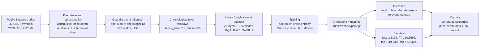
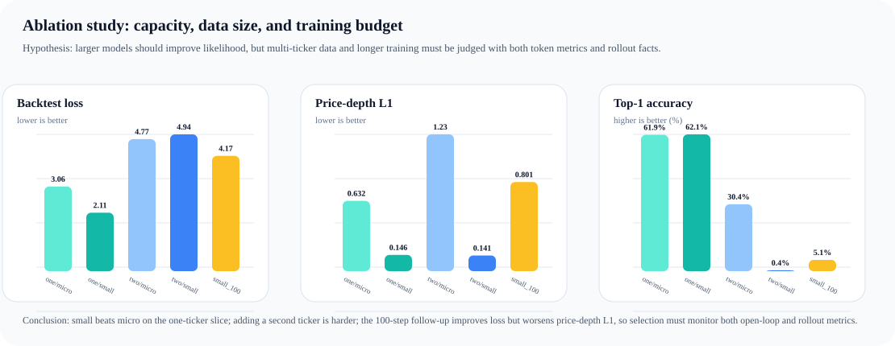

# Mega-Trading Technical Report

## Summary

Mega-Trading is a take-home prototype for modeling market-event sequences with the same basic idea used by language models: predict the next token from recent context. It uses public Binance trade archives, converts each trade event into a discrete event token, trains a compact Llama-style decoder, and evaluates the model on chronological holdout data.

The submitted baseline is the single-GPU run used by the poster and LaTeX report. Internal run IDs are kept only for reproducibility paths.

## Take-Home Scope

The interview prompt was intentionally open-ended: build a non-trivial system, choose the problem, decide how far to take it, define success criteria, and make the work reviewable through version control. I used that prompt to build an end-to-end system for generative market-event modeling rather than a single notebook or isolated model experiment.

- **Problem choice**: model public market events as a token sequence, inspired by LLM next-token prediction.
- **Data system**: download public Binance trade data, normalize it into event fields, fit a tokenizer, and create chronological train, validation, and backtest splits.
- **Model and training system**: implement a decoder-only Transformer, train it with mixed precision, track metrics with MLflow, and optimize throughput with preloaded NumPy streams, `torch.compile`, and a Triton attention path.
- **Evaluation**: report held-out loss, perplexity, top-k accuracy, simple baselines, and generated-versus-real event statistics.
- **System delivery**: package tokenizer metadata, reports, diagrams, and a Hugging Face Static Space page so the work can be reviewed end to end.
- **Version control**: keep configs, source modules, tests, and generated showcase artifacts separated so each part of the system is reviewable as a focused diff.

## Motivation and Fit

I chose this project because it connects the company's market-data focus with my own background as a research engineer building end-to-end foundation-model systems. [Deeter Analytics](https://deeteranalytics.com/) describes its mission as transforming complex market data into actionable insight with clarity, precision, foresight, and transparent methodology. A generative market-event modeling system is a natural take-home problem under that context: it starts from raw market data, builds a model-visible representation, trains a sequence model, evaluates outputs against held-out data, and packages the evidence for review.

My current work is on Amazon Nova foundation models, where the research engineering role is to partner with researchers and help move model ideas from experiments into production systems. Mega-Trading reflects that same operating style at take-home scale: define a research-shaped problem, build the data and training pipeline around it, optimize the system enough to run real experiments, and present success criteria and limitations honestly.

## Pipeline Diagram



## Data Contract

The data source is Binance public historical trade data. Each raw trade is mapped into a compact event representation:

- `action`: add or delete.
- `side`: buy or sell.
- `relative_price_bps`: log order price relative to estimated midprice.
- `price_depth_bps`: absolute relative price depth.
- `size`: causally normalized relative size.
- `interarrival_seconds`: elapsed time since the prior event for that ticker.

For the submitted dataset, the prepared artifacts report 62,012,828 token windows across 32 symbols and 1096 symbol-month partitions from 2023-05 to 2026-04. The chronological split contains 54,695,345 train windows, 1,116,216 validation windows, and 6,201,267 backtest windows.

## Tokenization

The tokenizer turns each event into one integer token ID formed from:

```text
action x side x relative_price_bucket x price_depth_bucket x size_bucket x time_bucket
```

The RTX tokenizer uses quantile binning with a 0.01 clip quantile. The fitted local vocabulary has 579 IDs, including special tokens. Realized bucket counts are: action=2, side=2, relative_price=2, price_depth=3, size=8, and time=3.

This choice keeps decoding auditable: every generated token maps back to an event-feature tuple rather than an opaque latent vector.

## Model Architecture

`TradingModel` is a Llama 3-style causal decoder:

- token embeddings with tied output logits;
- RoPE positional encoding;
- pre-norm decoder blocks;
- RMSNorm;
- grouped-query causal attention;
- SwiGLU feed-forward layers;
- next-token cross entropy objective.

The submitted single-GPU config uses `hidden_dim=1024`, `layers=20`, `attention_heads=16`, `kv_heads=4`, `intermediate_dim=2816`, `block_size=512`, and `dropout=0.0`. With the fitted vocabulary, this is approximately 226.1M tied-embedding trainable parameters.

The configuration is intentionally conservative for a single large CUDA GPU. GQA lowers KV projection cost, RoPE handles causal sequence position without learned absolute tables, and tied embeddings reduce parameters while preserving a simple token-language-model interface.

## Training and Optimization

Training is orchestrated through Hydra and Hugging Face Accelerate. The submitted run uses:

- optimizer: Muon plus AdamW routing;
- learning rate: 0.0002 with cosine decay;
- warmup: 125 steps;
- minimum learning rate: 2e-05;
- batch size: 64 sequences;
- gradient accumulation: 1;
- mixed precision: `mixed`;
- distributed strategy: `ddp` with world size 1;
- attention backend: `triton`;
- compile enabled: True.

The data path is optimized for long local runs: prepared NumPy streams are preloaded, dataloader workers are persistent, host transfer is pinned and non-blocking, and CUDA execution uses a Triton attention path where available. The final RTX metric row reports 108K tokens/sec and a last-50-point mean of 111K tokens/sec.

MLflow is enabled. The local SQLite tracking database contains 9 runs, 596,177 metric rows, 273 params, and 72 tags.

## Engineering Design Evidence

The repository includes design and profiling notes that make the engineering work auditable beyond the final metrics:

- [`docs/data-plane-design.md`](https://github.com/duoan/mega-trading/blob/main/docs/data-plane-design.md): Binance public-trades ingestion, bounded-memory streaming prepare, tokenizer artifacts, and chronological split contract.
- [`docs/training-plane-design.md`](https://github.com/duoan/mega-trading/blob/main/docs/training-plane-design.md): NumPy shard input contract, checkpoint and manifest outputs, Accelerate-based DDP/FSDP path, and backtest handoff.
- [`docs/kernels.md`](https://github.com/duoan/mega-trading/blob/main/docs/kernels.md): Triton causal GQA attention design and benchmark history. The submitted RTX-shape bf16 forward benchmark reports 156.23 approximate TFLOP/s versus 148.49 for PyTorch SDPA; backward is correct but still limited by dK/dV register pressure.
- [`docs/performance-profiling.md`](https://github.com/duoan/mega-trading/blob/main/docs/performance-profiling.md): end-to-end PyTorch profiler investigation. The baseline CPU optimizer window was 323.645 ms over two optimizer updates; after shape-bucketed Muon with `training.muon_ns_steps=3`, it dropped to about 20.018 ms.
- [`docs/training-configs.md`](https://github.com/duoan/mega-trading/blob/main/docs/training-configs.md): Mac, RTX, Modal, and default environments, showing how the same pipeline can run a smoke test, single-server CUDA training, or Modal GPU training through config-driven entry points.
- [`docs/training-systems-alignment.md`](https://github.com/duoan/mega-trading/blob/main/docs/training-systems-alignment.md): mapping from the implementation to training-system concerns such as throughput, GPU utilization, memory pressure, I/O bottlenecks, checkpoint reliability, and learning per unit of compute.

## Ablation Study

### Hypotheses

The first ablation pass tested three practical hypotheses:

- **Model capacity**: a small decoder should outperform a micro decoder on the same one-ticker slice.
- **Data size**: adding a second ticker should make the task harder at the same short training budget.
- **Training budget**: more steps should improve likelihood, but may not automatically improve generated rollout statistics.

The probe used Binance monthly trades for BTCUSDT and ETHUSDT in April 2026, `block_size=128`, `stride=4096`, 16 backtest batches, and 5 decoded examples per run.



| Data | Model | Steps | Train loss | Val loss | Backtest loss | Top-1 | Top-5 | Price-depth L1 |
|---|---|---:|---:|---:|---:|---:|---:|---:|
| 1 ticker | micro | 20 | 3.410 | 2.915 | 3.060 | 0.619 | 0.790 | 0.632 |
| 1 ticker | small | 20 | 2.580 | 1.922 | 2.114 | 0.621 | 0.802 | 0.146 |
| 2 tickers | micro | 20 | 3.675 | 4.773 | 4.771 | 0.304 | 0.597 | 1.229 |
| 2 tickers | small | 20 | 2.797 | 4.990 | 4.943 | 0.004 | 0.111 | 0.141 |
| 2 tickers | small | 100 | 1.457 | 4.152 | 4.166 | 0.051 | 0.161 | 0.801 |

The cleanest conclusion is the one-ticker capacity result: moving from micro to small reduced validation loss from 2.915 to 1.922, backtest loss from 3.060 to 2.114, and price-depth L1 from 0.632 to 0.146. The data-size result is more subtle: adding ETHUSDT made next-token classification much harder at 20 steps, even when the small model preserved a plausible marginal price-depth distribution. The 100-step follow-up improved backtest loss from 4.943 to 4.166, but worsened price-depth L1 from 0.141 to 0.801. Future run selection should therefore monitor both likelihood and rollout realism.

## Backtest Results

The `rtx` checkpoint was scored on 128 backtest batches, or 524,288 tokens.

| Metric | Value |
| --- | ---: |
| Backtest loss | 2.3379 |
| Backtest perplexity | 10.3592 |
| Backtest top-1 accuracy | 49.23% |
| Backtest top-5 accuracy | 69.42% |
| Price-depth distribution L1 | 0.1420 |

Generated-vs-real stylized facts show that the model captures part of the held-out event distribution but still has mismatch in tail behavior. Real excess kurtosis is 3.0948; generated excess kurtosis is 14.2966. That gap is a concrete target for better data, sampling, conditioning, and evaluation.

## Accuracy Baselines

Top-1 accuracy should not be read against a vague "random guess" baseline. With 579 realized token IDs, uniform random top-1 is only 0.17% and uniform random top-5 is 0.86%. The more serious issue is token imbalance: on the exact 524,288-token scored backtest sample, only 135 labels appear and the effective vocabulary is about 19.56.

Simple baselines on the same scored sample:

| Baseline | Top-1 / coverage |
| --- | ---: |
| Uniform random top-1 | 0.17% |
| Uniform random top-5 | 0.86% |
| Cheating backtest majority token | 25.41% |
| Cheating backtest top-5 frequency coverage | 59.83% |
| Copy previous token | 33.63% |
| Train-sample unigram top-1 | 2.10% |
| Train-sample unigram top-5 | 8.27% |
| Train-sample one-step Markov argmax | 31.91% |
| Model top-1 | 49.23% |
| Model top-5 | 69.42% |

This means the model is not worse than random. It is also meaningfully above copy-previous and one-step Markov baselines. However, the metric is still not enough by itself because composite-token prediction is heavily distribution-skewed. The poster therefore treats top-k accuracy as a sanity metric, not as evidence of trading usefulness.

## Inference

Inference follows the same artifact contract as training:

1. Load `runs/rtx/checkpoint.pt`.
2. Load `datasets/mixture=rtx/tokenizer.json` and `tokens-profile.json`.
3. Validate the vocabulary size and context length.
4. Provide either a recent context window or a beginning-of-sequence seed.
5. Call `TradingModel.generate(input_ids, max_new_tokens, top_k=16)`.
6. Decode generated token IDs back into event-feature tuples.
7. Use decoded price-depth and side features for scenario charts or downstream simulation.

This makes inference reproducible and auditable: every generated scenario can be traced back through tokenizer metadata and model manifest fields.

## Limitations

This is an open-loop public-data MVP. The current evaluation reports chronological backtest loss, perplexity, top-k token accuracy, and rollout-vs-real stylized facts. It does not yet implement the TradeFM-inspired closed-loop simulator that would validate order matching, fills, queue dynamics, market impact, stress behavior, or execution-policy performance.

The public Binance trade adapter is also a proxy for participant-observable order flow. Real L3 data should replace this path for serious microstructure modeling.

## Future Direction

- **L3 data**: ingest full add/delete/modify order lifecycle events, true best bid/ask midprice, queue position, and venue-specific order state.
- **Multimodal conditioning**: align news, filings, macro events, funding data, on-chain or flow signals, and sentiment with event-time order-flow tokens. In short, the multimodal roadmap is to condition market-event generation on external information without turning the model into a generic text generator.
- **Closed-loop simulator**: evaluate generated events inside a deterministic LOB simulator to measure fills, slippage, spread dynamics, and market impact.
- **Inference packaging**: ship checkpoint, tokenizer, manifest, and model card together so generated scenarios preserve provenance.
- **Evaluation expansion**: add regime-conditioned metrics, tail-risk tests, execution-policy benchmarks, and calibration checks.
